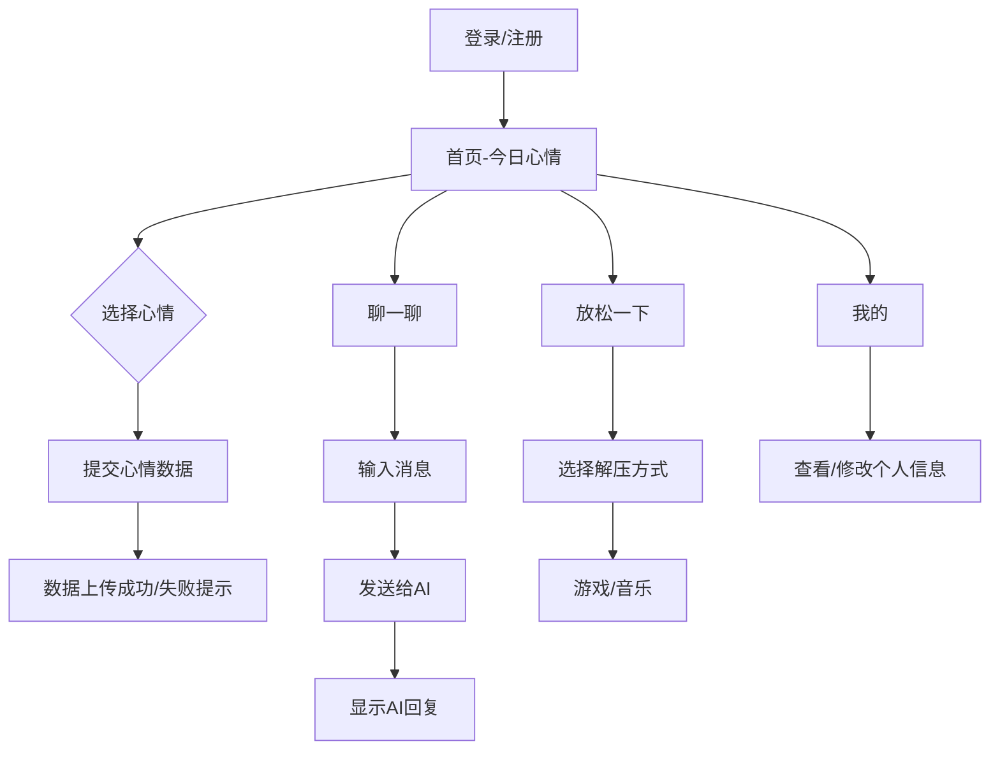
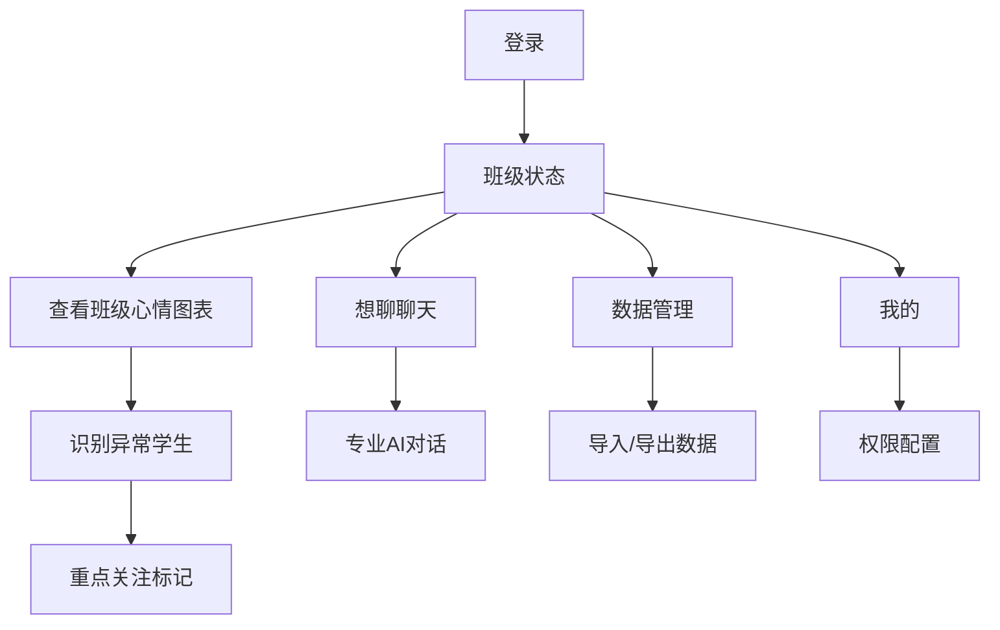

# 心理健康管理系统 PRD

## 1. Product Overview

星屿心理健康管理系统是一款专为青少年心理健康设计的综合性管理平台，提供学生端情绪管理和教师端数据监控功能。系统通过AI对话、心情记录、放松工具等功能，帮助青少年建立健康的心理习惯，同时为教师提供班级情绪状态分析和风险预警能力。

- **核心价值**: 构建零压力的青少年心理健康守护体系，实现家校共育
- **目标用户**: 12-18岁初高中生、学校心理健康教师

## 2. Core Features

### 2.1 User Roles
| Role | Registration Method | Core Permissions |
|------|---------------------|------------------|
| 学生 | 匿名注册/学校统一注册 | 心情打卡、AI对话、放松工具、个人资料管理 |
| 教师 | 学校管理员邀请注册 | 班级状态查看、学生数据管理、专业AI对话、数据导入导出 |

### 2.2 Feature Module

#### 学生端功能模块
1. **今日心情**: 心情打卡、情绪记录、数据统计
2. **聊一聊**: AI心理咨询对话、对话历史、话题引导
3. **放松一下**: 解压小游戏（拼图）、冥想引导、解压音乐播放器
4. **我的**: 个人资料、使用记录、通知中心、系统设置

#### 教师端功能模块
1. **班级状态**: 班级心情数据可视化、异常学生识别、风险预警
2. **想聊聊天**: 专业AI心理咨询对话、对话记录
3. **放松一下**: 与学生端一致的解压功能
4. **我的**: 个人信息管理、数据管理（导入导出）、权限配置

### 2.3 Page Details

#### 学生端页面
| Page Name | Module Name | Feature description |
|-----------|-------------|---------------------|
| 首页 | 今日心情 | 心情表情选择器、情绪量表、提交按钮、数据状态反馈 |
| 聊一聊 | AI对话 | 消息输入框、对话气泡展示、发送按钮、话题卡片 |
| 放松一下 | 解压游戏 | 拼图游戏、游戏控制、计分系统 |
| 放松一下 | 音乐播放器 | 音乐列表、播放控制（播放/暂停/音量）、进度条 |
| 我的 | 个人资料 | 头像、昵称、性别、年龄、签名 |
| 我的 | 使用记录 | 心情打卡记录、对话次数统计 |
| 我的 | 通知中心 | 系统通知、预警信息 |
| 我的 | 设置 | 账号安全、隐私设置、系统配置 |

#### 教师端页面
| Page Name | Module Name | Feature description |
|-----------|-------------|---------------------|
| 班级状态 | 数据可视化 | 心情趋势图表、班级统计数据、异常预警 |
| 班级状态 | 学生列表 | 学生心情状态列表、重点关注标记 |
| 想聊聊天 | AI对话 | 专业心理咨询对话、对话历史 |
| 放松一下 | 解压功能 | 与学生端一致的解压游戏和音乐 |
| 我的 | 个人资料 | 教师信息、教龄、职称 |
| 我的 | 数据管理 | 数据导入（Excel/CSV）、数据导出 |
| 我的 | 权限配置 | 班级管理权限、数据查看权限 |

## 3. Core Process

### 学生端核心流程

### 教师端核心流程

## 4. User Interface Design

### 4.1 Design Style
- **Primary Color**: 柔和渐变蓝紫色（#6B7BFF → #A78BFA）
- **Secondary Color**: 温暖橙色（#F4A261）作为强调色
- **Background**: 渐变淡紫色背景，营造舒适放松的氛围
- **Button Style**: 圆润、柔和渐变、悬停微动画
- **Font**: 现代无衬线字体（Inter），字重400-600
- **Layout**: 卡片式布局、圆角设计、柔和阴影
- **Icon Style**: 线性图标，柔和色彩

### 4.2 Page Design Overview

#### 学生端首页
| Module | UI Elements |
|--------|-------------|
| Header | Logo、搜索框、通知图标 |
| 今日心情 | 5个表情卡片（开心/平静/低落/焦虑/难过）、日期显示、提交按钮 |
| 快捷入口 | 聊一聊、放松一下快捷图标 |
| 情绪趋势 | 近7天心情折线图 |

#### 聊一聊页面
| Module | UI Elements |
|--------|-------------|
| Header | 返回按钮、标题 |
| 对话区域 | 消息气泡（用户/AI）、滚动容器 |
| 输入区域 | 文本输入框、发送按钮、话题卡片按钮 |
| 话题卡片 | 可选择的对话话题 |

#### 放松一下页面
| Module | UI Elements |
|--------|-------------|
| Tab切换 | 游戏/音乐切换标签 |
| 游戏区域 | 拼图游戏界面、计时器、得分 |
| 音乐区域 | 音乐列表、播放器控件 |

#### 我的页面
| Module | UI Elements |
|--------|-------------|
| 个人信息卡片 | 头像、昵称、年龄、签名 |
| 功能列表 | 使用记录、通知中心、设置（列表项） |

#### 教师端班级状态页面
| Module | UI Elements |
|--------|-------------|
| Header | Logo、班级选择器 |
| 统计卡片 | 班级人数、平均心情、预警人数 |
| 心情图表 | 班级心情趋势柱状图/折线图 |
| 学生列表 | 学生卡片（心情状态、预警标记） |

### 4.3 Responsiveness
- **Desktop-first**: 1200px+ 完整功能展示
- **Tablet**: 768px-1199px 自适应布局
- **Mobile**: <768px 响应式菜单、堆叠布局、触摸优化

### 4.4 Interaction Design
- 心情选择：点击表情卡片选中，再次点击取消
- 消息发送：回车或点击发送按钮，发送时显示加载动画
- 游戏交互：拖拽拼图块、点击旋转
- 音乐控制：播放/暂停切换、进度条拖动
- 图表交互：鼠标悬停显示详细数据、点击筛选

## 5. Security Requirements
- 数据传输加密（HTTPS/TLS 1.3）
- 用户数据端到端加密
- 敏感信息脱敏展示
- 完善的错误处理和状态反馈