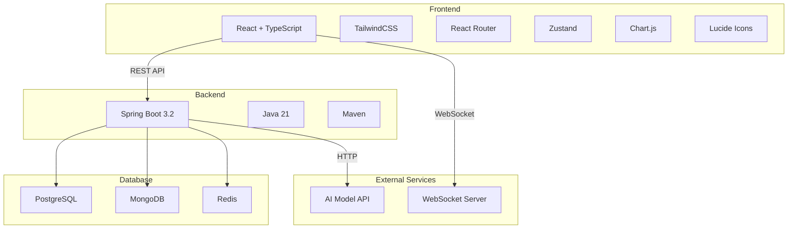
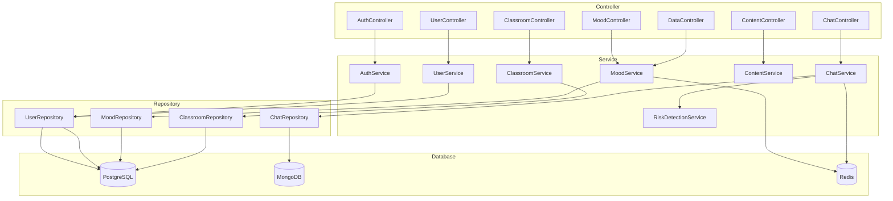
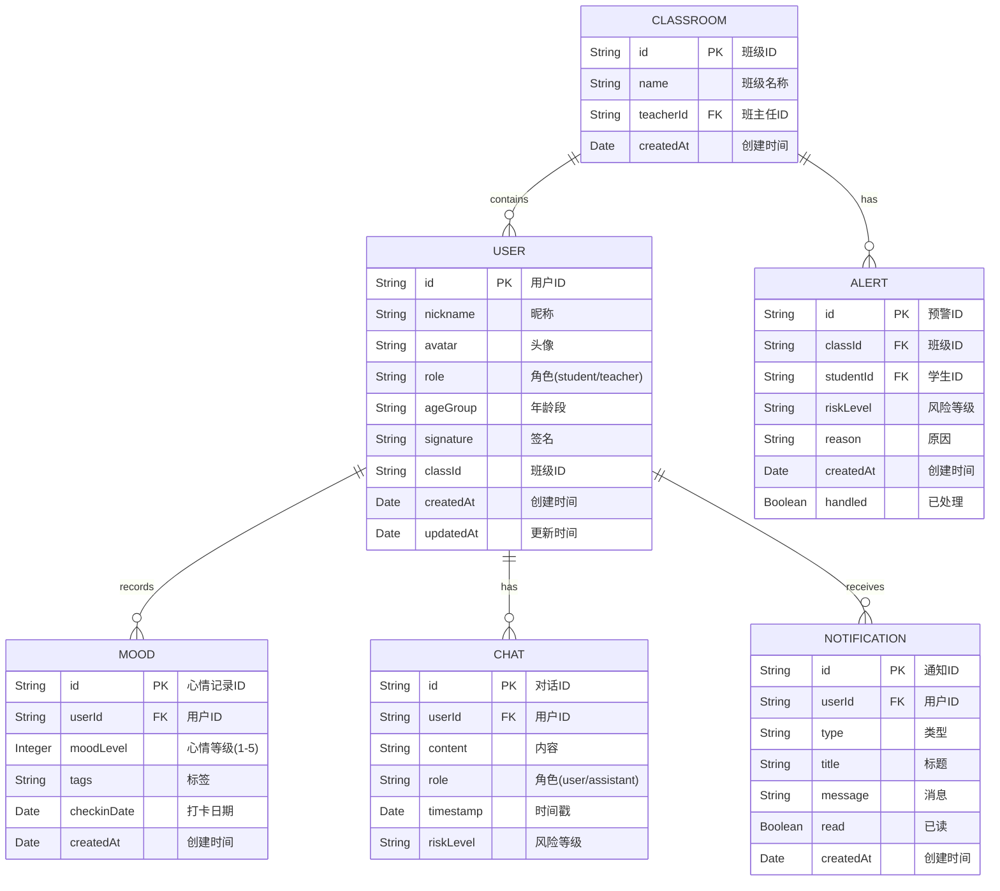

# 心理健康管理系统技术架构文档

## 1. Architecture Design



## 2. Technology Description

- **Frontend**: React@18 + TypeScript + TailwindCSS@3 + Vite
- **Routing**: React Router DOM@6
- **State Management**: Zustand
- **Charting**: Chart.js + react-chartjs-2
- **Icons**: Lucide React
- **Backend**: Spring Boot@3.2 + Java 21 + Maven
- **Database**: PostgreSQL (关系数据) + MongoDB (非关系数据) + Redis (缓存)
- **Real-time**: WebSocket

## 3. Route Definitions

### 学生端路由
| Route | Purpose | Component |
|-------|---------|-----------|
| /student | 学生端首页（今日心情） | StudentHome |
| /student/chat | AI对话页面 | StudentChat |
| /student/relax | 放松工具页面 | StudentRelax |
| /student/profile | 个人中心页面 | StudentProfile |
| /student/profile/records | 使用记录 | RecordsPage |
| /student/profile/notifications | 通知中心 | NotificationsPage |
| /student/profile/settings | 系统设置 | SettingsPage |

### 教师端路由
| Route | Purpose | Component |
|-------|---------|-----------|
| /teacher | 教师端首页（班级状态） | TeacherHome |
| /teacher/chat | 专业AI对话 | TeacherChat |
| /teacher/relax | 放松工具页面 | TeacherRelax |
| /teacher/profile | 个人中心页面 | TeacherProfile |
| /teacher/profile/data | 数据管理 | DataManagementPage |
| /teacher/profile/permissions | 权限配置 | PermissionsPage |

### 公共路由
| Route | Purpose | Component |
|-------|---------|-----------|
| / | 登录/注册页面 | AuthPage |
| /role-select | 角色选择 | RoleSelect |

## 4. API Definitions

### 认证接口
| Method | Endpoint | Request Body | Response |
|--------|----------|--------------|----------|
| POST | /api/v1/auth/login | `{ username, password, role }` | `{ token, user }` |
| POST | /api/v1/auth/register | `{ nickname, password, role, ageGroup? }` | `{ user }` |
| POST | /api/v1/auth/logout | - | `{ success }` |

### 学生端接口
| Method | Endpoint | Request Body | Response |
|--------|----------|--------------|----------|
| POST | /api/v1/mood/checkin | `{ userId, moodLevel, tags }` | `{ message, checkinDate, continuousDays }` |
| GET | /api/v1/mood/history/{userId} | - | `{ history, trend }` |
| POST | /api/v1/chat/message | `{ userId, message, context }` | `{ response, riskLevel }` |
| GET | /api/v1/chat/history/{userId} | - | `{ messages }` |
| GET | /api/v1/content/meditations | - | `{ meditations }` |
| GET | /api/v1/content/breathing/{type} | - | `{ breathing }` |
| GET | /api/v1/users/{id} | - | `{ user }` |
| PUT | /api/v1/users/{id} | `{ nickname, avatar, signature }` | `{ user }` |
| GET | /api/v1/notifications/{userId} | - | `{ notifications }` |

### 教师端接口
| Method | Endpoint | Request Body | Response |
|--------|----------|--------------|----------|
| GET | /api/v1/classroom/{classId}/stats | - | `{ statistics, chartData }` |
| GET | /api/v1/classroom/{classId}/students | - | `{ students, alerts }` |
| POST | /api/v1/chat/teacher/message | `{ userId, message }` | `{ response }` |
| POST | /api/v1/data/import | `{ file, type }` | `{ success, count }` |
| GET | /api/v1/data/export/{type} | - | File download |
| GET | /api/v1/permissions/{userId} | - | `{ permissions }` |
| PUT | /api/v1/permissions/{userId} | `{ permissions }` | `{ permissions }` |

## 5. Server Architecture Diagram



## 6. Data Model

### 6.1 Data Model Definition



### 6.2 Data Definition Language

```sql
CREATE TABLE users (
    id VARCHAR(36) PRIMARY KEY,
    nickname VARCHAR(50) NOT NULL,
    avatar VARCHAR(255),
    role VARCHAR(20) NOT NULL DEFAULT 'student',
    age_group VARCHAR(20),
    signature VARCHAR(200),
    class_id VARCHAR(36),
    created_at TIMESTAMP DEFAULT CURRENT_TIMESTAMP,
    updated_at TIMESTAMP DEFAULT CURRENT_TIMESTAMP
);

CREATE TABLE moods (
    id VARCHAR(36) PRIMARY KEY,
    user_id VARCHAR(36) NOT NULL,
    mood_level INTEGER NOT NULL CHECK (mood_level BETWEEN 1 AND 5),
    tags TEXT[],
    checkin_date DATE NOT NULL,
    created_at TIMESTAMP DEFAULT CURRENT_TIMESTAMP,
    FOREIGN KEY (user_id) REFERENCES users(id)
);

CREATE TABLE classrooms (
    id VARCHAR(36) PRIMARY KEY,
    name VARCHAR(100) NOT NULL,
    teacher_id VARCHAR(36) NOT NULL,
    created_at TIMESTAMP DEFAULT CURRENT_TIMESTAMP,
    FOREIGN KEY (teacher_id) REFERENCES users(id)
);

CREATE TABLE alerts (
    id VARCHAR(36) PRIMARY KEY,
    class_id VARCHAR(36) NOT NULL,
    student_id VARCHAR(36) NOT NULL,
    risk_level VARCHAR(20) NOT NULL,
    reason TEXT,
    created_at TIMESTAMP DEFAULT CURRENT_TIMESTAMP,
    handled BOOLEAN DEFAULT FALSE,
    FOREIGN KEY (class_id) REFERENCES classrooms(id),
    FOREIGN KEY (student_id) REFERENCES users(id)
);

CREATE TABLE notifications (
    id VARCHAR(36) PRIMARY KEY,
    user_id VARCHAR(36) NOT NULL,
    type VARCHAR(50) NOT NULL,
    title VARCHAR(100) NOT NULL,
    message TEXT,
    read BOOLEAN DEFAULT FALSE,
    created_at TIMESTAMP DEFAULT CURRENT_TIMESTAMP,
    FOREIGN KEY (user_id) REFERENCES users(id)
);

CREATE INDEX idx_users_role ON users(role);
CREATE INDEX idx_moods_user_date ON moods(user_id, checkin_date);
CREATE INDEX idx_alerts_class ON alerts(class_id);
CREATE INDEX idx_notifications_user_read ON notifications(user_id, read);
```

## 7. Frontend Project Structure

```
src/
├── components/
│   ├── common/           # 通用组件
│   │   ├── Header.tsx
│   │   ├── Footer.tsx
│   │   ├── Button.tsx
│   │   ├── Card.tsx
│   │   └── Loading.tsx
│   ├── student/          # 学生端组件
│   │   ├── MoodSelector.tsx
│   │   ├── ChatBubble.tsx
│   │   ├── TopicCard.tsx
│   │   ├── PuzzleGame.tsx
│   │   └── MusicPlayer.tsx
│   └── teacher/          # 教师端组件
│       ├── ClassStats.tsx
│       ├── MoodChart.tsx
│       ├── StudentList.tsx
│       └── AlertBadge.tsx
├── pages/
│   ├── AuthPage.tsx
│   ├── RoleSelect.tsx
│   ├── student/
│   │   ├── StudentHome.tsx
│   │   ├── StudentChat.tsx
│   │   ├── StudentRelax.tsx
│   │   └── StudentProfile.tsx
│   └── teacher/
│       ├── TeacherHome.tsx
│       ├── TeacherChat.tsx
│       ├── TeacherRelax.tsx
│       └── TeacherProfile.tsx
├── hooks/
│   ├── useAuth.ts
│   ├── useMood.ts
│   ├── useChat.ts
│   └── useClassroom.ts
├── store/
│   ├── authStore.ts
│   ├── moodStore.ts
│   └── chatStore.ts
├── utils/
│   ├── api.ts
│   ├── encryption.ts
│   └── formatters.ts
├── types/
│   └── index.ts
├── App.tsx
├── main.tsx
└── index.css
```

## 8. Security Considerations

- JWT Token认证，token存储在HttpOnly Cookie
- HTTPS/TLS 1.3加密传输
- 前端请求添加CSRF防护
- 敏感数据传输加密（AES-256-GCM）
- 输入验证和XSS防护
- SQL注入防护（使用参数化查询）