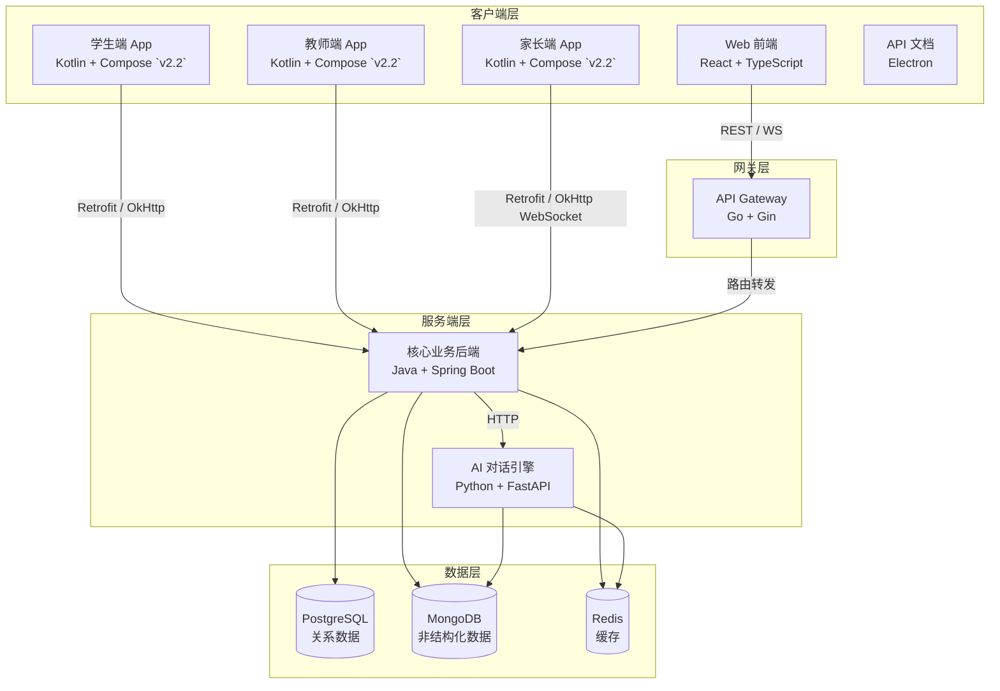
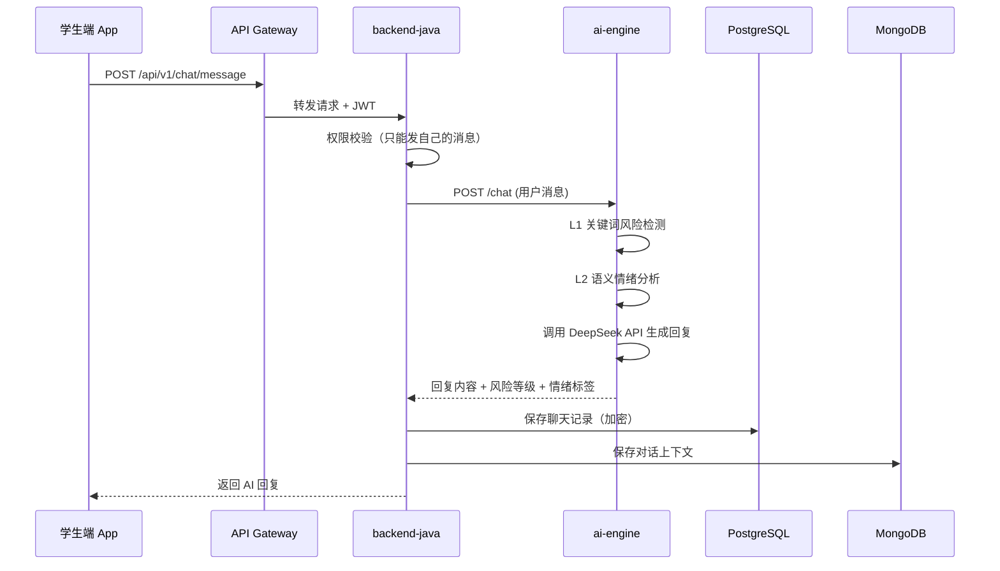
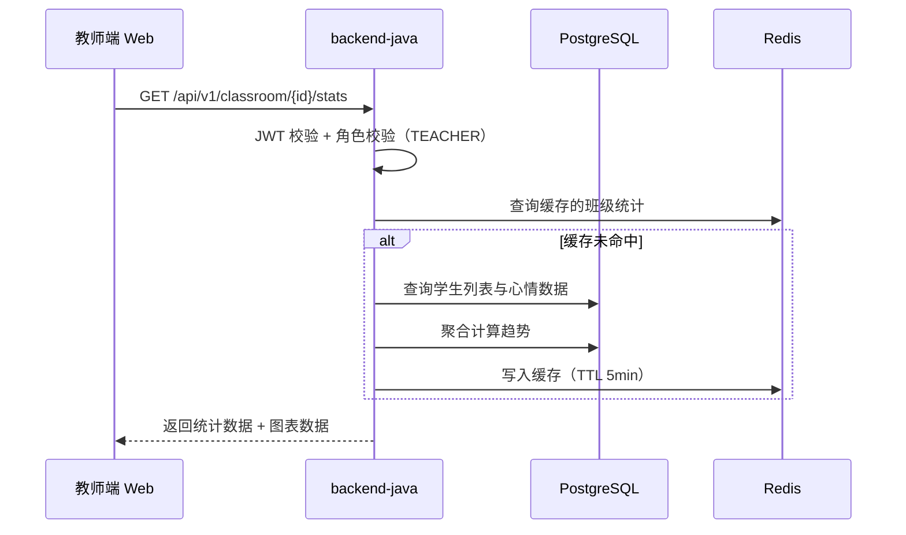
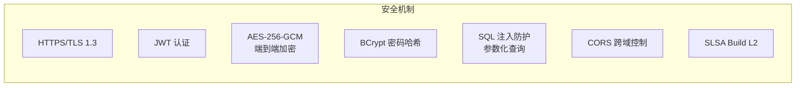
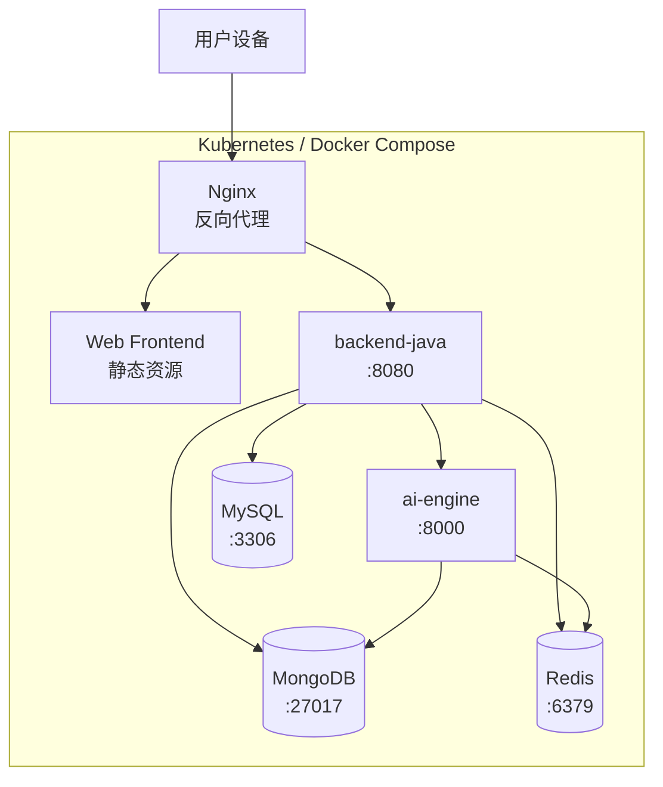

# 项目整体架构

## 架构概览

StarIsle 采用经典的分层架构，分为**客户端层**、**服务端层**和**数据层**，通过 REST API 和 WebSocket 进行通信。

> **v2.2 变更**：学生端 / 教师端 / 家长端三端移动 App 从 Flutter/React 迁移到 Kotlin + Jetpack Compose。客户端直连 backend-java（不经 Go 网关），原 Flutter/React 源码保留作为参考实现。

## 分层说明

### 1. 客户端层

负责用户界面展示和交互，支持多角色、多平台访问。

| 客户端 | 技术栈 | 目标用户 | 核心功能 |
|--------|--------|---------|---------|
| Web 前端 | React 18 + TypeScript + Vite | 学生/教师/家长 | 情绪打卡、AI 对话、趋势分析 |
| 学生端 App | **Kotlin + Compose + Hilt + Room** `v2.2迁移` 原 Flutter + Riverpod（参考实现） | 学生 | 移动端心情打卡、AI 对话、冥想、紧急帮助、AI 工具中心 |
| 教师端 App | **Kotlin + Compose + Hilt** `v2.2迁移` 原 Flutter + Riverpod（参考实现） | 教师 | 班级状态、学生管理、告警处理、4 Tab 底部导航 |
| 家长端 App | **Kotlin + Compose + Hilt + OkHttp WebSocket** `v2.2迁移` 原 React/TS + Zustand（参考实现） | 家长 | 孩子情绪查看、AI 心理顾问对话、应急预案、情绪趋势 |
| API 文档 | React + Electron | 开发者 | OpenAPI 可视化、接口测试 |

### 2. 网关层

统一入口，负责请求路由、认证鉴权、限流和日志。

- **技术**: Go 1.21 + Gin 1.9.x
- **职责**: 
  - 统一认证入口（JWT 校验）
  - 请求路由与负载均衡
  - CORS 跨域处理
  - 速率限制
- **注意**: 当前项目处于过渡期，`backend-java/`（Spring Boot）是主要开发版本，`server-services/backend/`（Go）作为 API 网关保留。

### 3. 服务端层

#### 3.1 核心业务后端（backend-java）

- **技术**: Java 21 + Spring Boot 3.2.5 + Maven
- **职责**:
  - 用户注册/登录/认证（JWT）
  - 心情打卡数据管理
  - 对话历史存储与转发
  - 风险检测与预警
  - 家长绑定与授权管理
  - 端到端加密通信

#### 3.2 AI 对话引擎（server-services/ai-engine）

- **技术**: Python 3.10 + FastAPI 0.108.x
- **职责**:
  - 基于 CBT 框架的 AI 对话生成
  - 实时情绪分析（L1 关键词 28 类 + L1.5 持续时间 + L1.6 心情历史 + L2 语义分析，v1.9 准确率 100%）
  - 风险等级判定（green/yellow/orange/red）
  - 话题引导卡片生成
  - 支持 DeepSeek API 或本地模型推理
  - **Skill 动态路由 + 错误降级**（`v2.0新增`：SkillRouter + BaseSkill + 多个 Adapter，错误自动禁用技能）
  - **GitHub Fork 三层集成**（`v2.0新增`：代码能力 Skill Adapter + RAG knowledge_base.json 注入 + 语料 combined_cleaned_text.txt 清洗）
  - **训练流水线**（`v2.0新增`：可选 Orchestrator 6 步 discover→integrate→mlm→sft→evaluate→report，支持 --smoke 仿真无 GPU 运行）

### 4. 数据层

| 数据库 | 用途 | 关键数据 |
|--------|------|---------|
| PostgreSQL 14 | 关系型数据存储（测试环境） | 用户、心情记录、班级、预警、通知 |
| MySQL 8.x | 关系型数据存储（Docker Compose 默认生产） | 同上 |
| H2 内存 | 关系型数据存储（本地开发默认） | 同上，重启清空 |
| MongoDB 6.0 | 非结构化数据存储 | 聊天消息、对话上下文、知识库 |
| Redis 7.0 | 缓存与会话 | 会话状态、热点数据、速率限制计数 |

## 数据流向

### 典型场景：学生发送 AI 对话消息

### 典型场景：教师查看班级情绪趋势

## 安全架构

- **传输层**: HTTPS/TLS 1.3 全程加密
- **认证层**: JWT Token + BCrypt 密码哈希 + Spring Security 角色控制
- **数据层**: AES-256-GCM 端到端加密、SQLCipher 本地加密存储（v2.2 Kotlin 版暂用 Room，未加密，后续将接入 SQLCipher）
- **供应链**: GitHub Actions SLSA Build Level 2 构建来源证明

## 部署架构

## 技术选型理由

| 技术 | 选型理由 |
|------|---------|
| React + Vite | 现代化前端生态，快速 HMR，TypeScript 原生支持 |
| Kotlin + Jetpack Compose `v2.2迁移` | Android 官方推荐，单语言覆盖 UI/逻辑/并发，编译时类型安全；声明式 UI 与原 Flutter 声明式范式接近，迁移成本低；Hilt/Room/Navigation 官方支持 |
| Flutter（保留为参考实现） | 一套代码覆盖 iOS/Android，适合资源有限的团队；v2.2 后仅作为对照实现保留 |
| Spring Boot | 成熟的企业级 Java 生态，安全、事务、JPA 开箱即用 |
| Go + Gin | 高并发网关层，编译快、资源占用低 |
| FastAPI | Python 异步高性能，AI/ML 生态无缝集成 |
| PostgreSQL | 稳定的关系型数据库，支持复杂查询和 JSON 字段 |
| MongoDB | 灵活存储聊天消息等非结构化数据 |
| Redis | 会话缓存、热点数据、分布式锁 |
| Hilt `v2.2新增` | Android 官方 DI 方案，编译时依赖图校验，替代 Riverpod/Zustand |
| Room `v2.2新增` | Android 官方 ORM，编译时 SQL 校验，替代 sqflite_sqlcipher（暂未启用加密） |
| WorkManager `v2.2新增` | Android 官方后台任务，替代 workmanager package，支持周期任务与约束 |
| Navigation Compose `v2.2新增` | Android 官方导航，替代 Flutter Navigator / React Router，类型安全路由 |
| Retrofit + OkHttp `v2.2新增` | Android 主流 HTTP 栈，替代 http package / fetch，原生支持 WebSocket |
| PEFT（LoRA）`v2.0新增` | 大模型微调显存占用降低 90%+，适合单机 A100 |
| Accelerate `v2.0新增` | 分布式训练/混合精度/CPU Offload，统一显存降级链 |
| Datasets `v2.0新增` | HuggingFace 统一训练数据格式，支持多源拼接与去重 |
| LangDetect `v2.0新增` | Fork 语料清洗时语种检测过滤，避免中文模型训练英文噪音 |
| GitPython `v2.0新增` | GitHub Fork 仓库克隆与元数据提取，集成 RAG/Skill/SFT |
