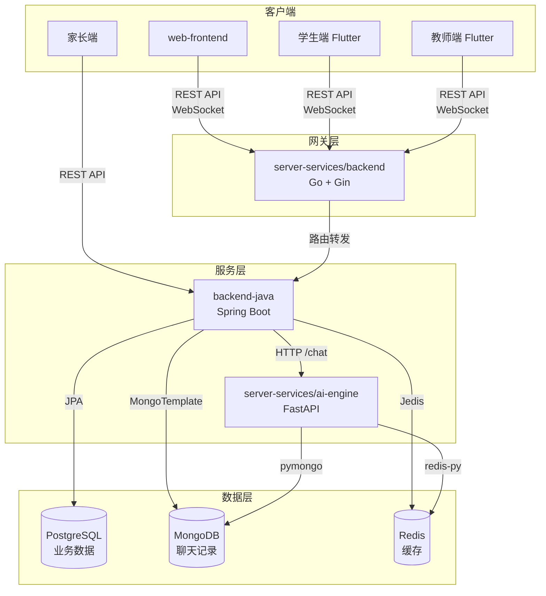
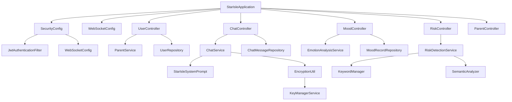
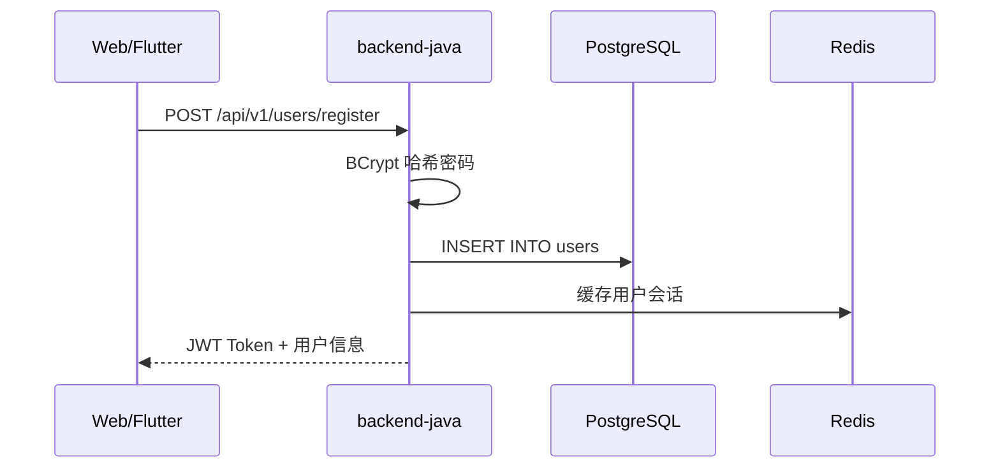
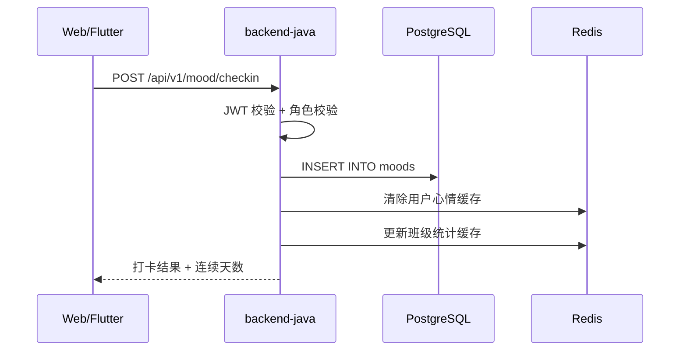
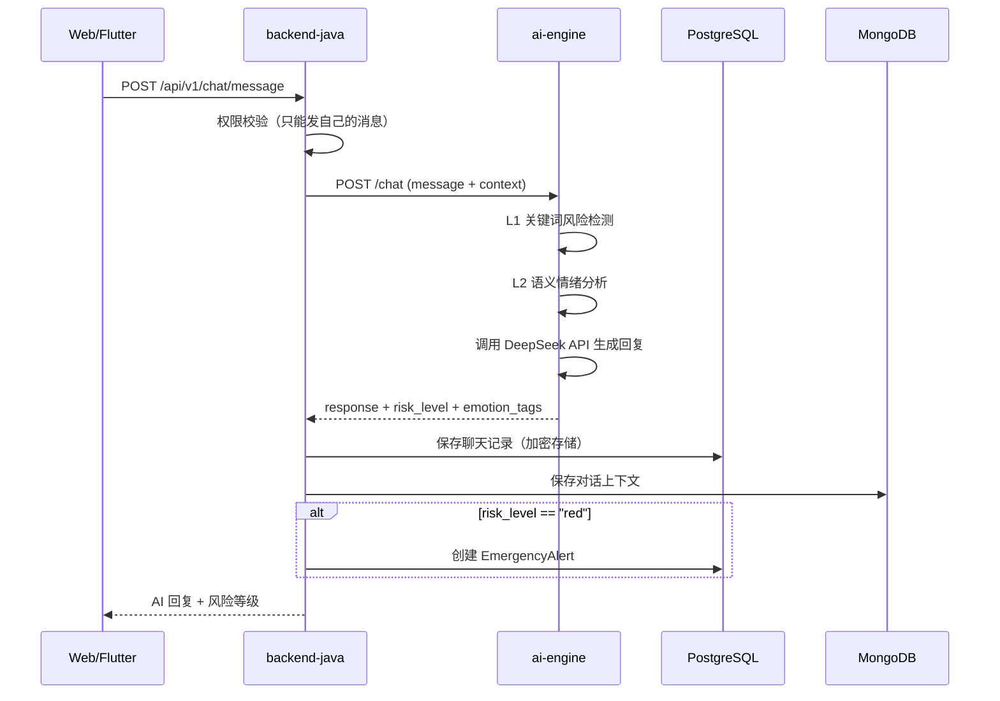

# 依赖关系

## 模块依赖总览



## 前端到后端的 API 依赖

### Web 前端 (`web-frontend`)

| 前端页面 | 依赖 API | 后端模块 |
|---------|---------|---------|
| `Login.tsx` | `POST /api/v1/users/login` | backend-java |
| `StudentHome.tsx` | `POST /api/v1/mood/checkin` | backend-java |
| `StudentHome.tsx` | `GET /api/v1/mood/history/{userId}` | backend-java |
| `StudentChat.tsx` | `POST /api/v1/chat/message` | backend-java |
| `StudentChat.tsx` | `GET /api/v1/chat/history/{userId}` | backend-java |
| `StudentRelax.tsx` | `GET /api/v1/content/meditations` | backend-java |
| `TeacherHome.tsx` | `GET /api/v1/classroom/{id}/stats` | backend-java |
| `TeacherHome.tsx` | `GET /api/v1/classroom/{id}/students` | backend-java |
| `ParentHome.tsx` | `GET /api/v1/parents/children` | backend-java |
| `ParentHome.tsx` | `GET /api/v1/parents/mood-trend` | backend-java |
| `ParentChat.tsx` | `POST /api/v1/chat/message` | backend-java |

### Flutter 学生端 (`student-app/StarIsle-student`)

| Dart 组件 | 依赖 API | 说明 |
|----------|---------|------|
| `home_screen.dart` | `POST /api/v1/mood/checkin` | 心情打卡 |
| `chat_screen.dart` | `WebSocket /ws/chat/{userId}` | 实时对话 |
| `chat_screen.dart` | `POST /api/v1/chat/message` | HTTP 对话备选 |
| `ai_service.dart` | `GET /api/v1/content/meditations` | 冥想列表 |

### Flutter 教师端 (`teacher-app/StarIsle-teacher`)

| Dart 组件 | 依赖 API | 说明 |
|----------|---------|------|
| `workbench_screen.dart` | `GET /api/v1/classroom/{id}/stats` | 班级统计 |
| `students_screen.dart` | `GET /api/v1/classroom/{id}/students` | 学生列表 |
| `chat_screen.dart` | `POST /api/v1/chat/teacher/message` | 教师 AI 对话 |

## 后端内部依赖

### backend-java 内部依赖



### backend-java 到外部服务

| 依赖方 | 被依赖方 | 调用方式 | 用途 |
|--------|---------|---------|------|
| `ChatService` | `server-services/ai-engine` | HTTP POST `/chat` | AI 对话生成 |
| `RiskDetectionService` | `server-services/ai-engine` | HTTP POST `/risk/check` | 风险检测（备选） |
| `EmotionAnalysisService` | `server-services/ai-engine` | HTTP POST `/emotion/analyze` | 情绪分析（备选） |
| backend-java | PostgreSQL | JDBC / JPA | 用户、心情、班级、预警数据 |
| backend-java | MongoDB | spring-data-mongodb | 聊天消息存储 |
| backend-java | Redis | Jedis | 会话缓存、热点数据 |

### AI 引擎到外部服务

| 依赖方 | 被依赖方 | 调用方式 | 用途 |
|--------|---------|---------|------|
| `ChatService` | DeepSeek API | OpenAI SDK HTTP | 大模型对话生成 |
| `RiskDetectionService` | `SemanticAnalyzer` | 本地模型 | 语义风险分析 |
| `SemanticAnalyzer` | Word2Vec 模型 | 本地文件 | 词向量语义分析 |
| server-services/ai-engine | MongoDB | pymongo | 对话上下文存储 |
| server-services/ai-engine | Redis | redis-py | 缓存 |

## 数据流依赖

### 用户注册登录流程



### 心情打卡流程



### AI 对话完整链路



## 构建与部署依赖

### Docker Compose 服务依赖

```yaml
# 启动顺序（由 depends_on + condition: service_healthy 控制）
1. mysql      (端口 3306)
2. mongodb    (端口 27017)
3. redis      (端口 6379)
4. backend-java (端口 8080，依赖 mysql/mongodb/redis)
5. ai-engine   (端口 8000，依赖 redis/mongodb)
```

### CI/CD 构建依赖

| GitHub Actions 工作流 | 构建目标 | 触发条件 |
|----------------------|---------|---------|
| `slsa-backend-java.yml` | backend-java Docker 镜像 | push / tags / release |
| `slsa-ai-engine.yml` | ai-engine Docker 镜像 | push / tags / release |
| `slsa-web-frontend.yml` | web-frontend 静态资源 + 镜像 | push / tags / release |

### 开发环境依赖关系

| 模块 | 开发前必须启动 | 说明 |
|------|--------------|------|
| web-frontend | backend-java（可选） | 前端可独立开发，mock 数据在 authStore 中 |
| backend-java | 无需外部依赖（使用 H2） | 开发环境默认使用 H2 内存数据库 |
| backend-java（完整功能） | PostgreSQL + MongoDB + Redis | 需注释掉 application.yml 中的 autoconfigure exclude |
| ai-engine | 无需外部依赖 | 需配置 MODEL_API_KEY 环境变量 |
| Flutter App | backend-java | 需要真实后端提供 API |

## 第三方依赖总览

### Maven (backend-java)

| 依赖 | 版本 | 用途 |
|------|------|------|
| spring-boot-starter-web | 3.2.5 | Web 服务 |
| spring-boot-starter-websocket | 3.2.5 | WebSocket 支持 |
| spring-boot-starter-data-jpa | 3.2.5 | JPA 数据访问 |
| spring-boot-starter-security | 3.2.5 | 安全框架 |
| spring-boot-starter-data-mongodb | 3.2.5 | MongoDB 支持 |
| jjwt-api/impl/jackson | 0.12.5 | JWT 实现 |
| postgresql | - | PostgreSQL 驱动 |
| mysql-connector-j | 8.4.0 | MySQL 驱动 |
| h2 | - | H2 开发数据库 |
| jedis | 5.1.0 | Redis 客户端 |
| lombok | - | 代码简化 |

### npm (web-frontend)

| 依赖 | 版本 | 用途 |
|------|------|------|
| react / react-dom | 18.3.1 | UI 框架 |
| react-router-dom | 7.3.0 | 路由 |
| zustand | 5.0.3 | 状态管理 |
| tailwindcss | 3.4.17 | CSS 工具 |
| lucide-react | 0.511.0 | 图标 |
| clsx | 2.1.1 | 条件类名 |
| tailwind-merge | 3.0.2 | 类名合并 |

### Python (ai-engine)

| 依赖 | 版本 | 用途 |
|------|------|------|
| fastapi | 0.108.0 | Web 框架 |
| uvicorn | 0.25.0 | ASGI 服务器 |
| transformers | 4.36.2 | 预训练模型 |
| torch | 2.1.2 | 深度学习 |
| openai | 1.6.1 | API 调用 |
| langchain | 0.1.0 | LLM 框架 |
| scikit-learn | 1.3.2 | 机器学习 |
| pymongo | 4.6.1 | MongoDB |
| redis | 5.0.1 | Redis |
| kafka-python | 2.0.2 | 消息队列 |

### Go (server-services/backend)

| 依赖 | 版本 | 用途 |
|------|------|------|
| gin-gonic/gin | 1.9.1 | Web 框架 |
| go-redis/redis/v8 | 8.11.5 | Redis |
| mongo-driver | 1.13.1 | MongoDB |
| gorm/gorm | 1.25.5 | ORM |
| gorm/driver/postgres | 1.5.4 | PostgreSQL 驱动 |
| segmentio/kafka-go | 0.4.47 | Kafka |

### Flutter (学生端/教师端)

| 依赖 | 用途 |
|------|------|
| flutter_riverpod | 状态管理 |
| http / web_socket_channel | 网络 |
| sqflite_sqlcipher | 加密数据库 |
| just_audio | 音频 |
| lottie / rive | 动画 |
| fl_chart | 图表 |
| workmanager | 后台任务 |
